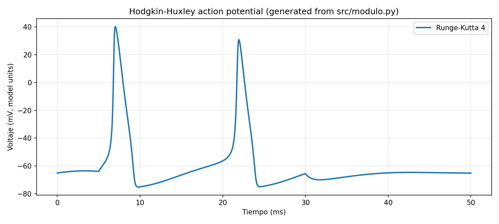

# Neuron Action Potential Simulation

Simulation of the neuronal action potential using the Hodgkin–Huxley model, with a PyQt5 interface and multiple numerical ODE solvers implemented in Python.


## What this project does

`src/modulo.py` defines Hodgkin–Huxley channel dynamics (`m`, `h`, `n`) and membrane voltage (`V`) and provides these solver implementations:

- Euler Forward (`EulerFor`)
- Euler Backward (`EulerBack`)
- Modified Euler (`EulerMod`)
- Runge-Kutta 2 (`RungeKutta2`)
- Runge-Kutta 4 (`RungeKutta4`)
- SciPy `solve_ivp` (`scipy_solve`)
- SciPy `odeint` (`scipy_odeint`)

The GUI entry point is `src/interfaz.py`, which connects UI controls to these methods and plots the membrane potential over time.

## Installation

```bash
python -m venv venv
source venv/bin/activate
pip install -r requirements.txt
```

## Usage

### Run a numerical simulation from the command line

```bash
python - <<'PY'
import sys
sys.path.insert(0, 'src')
import modulo as mod

initial = [-65.0, 0.3, 0.05, 0.65]  # [V, n, m, h]
t, v = mod.RungeKutta4(initial, 50, 6.3, lambda x: 10.0 if 5 < x < 30 else 0.0)
print(len(t), len(v), round(float(v.max()), 4))
PY
```

### Run the PyQt interface

`src/interfaz.py` loads `bb.ui` from the current working directory.

```bash
cp assets/bb.ui .
python src/interfaz.py
```

## Example output

Generated from `src/modulo.py` using `RungeKutta4`:



## Project structure

```text
.
├── assets/
│   ├── bb.ui                  # Qt Designer UI file
│   ├── gorro.png              # icon asset
│   ├── pulpo.png              # image asset
│   └── imagenes.qrc           # Qt resource manifest
├── docs/
│   ├── index.html             # GitHub Pages site
│   └── assets/
│       ├── style.css
│       └── simulation-rk4.png
├── src/
│   ├── interfaz.py            # PyQt5 GUI entry point
│   ├── modulo.py              # Hodgkin–Huxley model + solvers
│   ├── grafica.py             # Matplotlib Qt widget
│   └── imagenes.py            # compiled Qt resources
├── requirements.txt
└── LICENSE
```

## Reference material in repository

The `docs/` folder also includes PDFs used as project references:

- `A QUANTITATIVE DESCRIPTION OF MEMBRANE CURRENT AND ITS APPLICATION TO CONDUCTION AND EXCITATION IN NERVE.pdf`
- `The Hodgkin–Huxley Equations.pdf`
- `Proyecto Final Potencial de Acción  - VF.pdf`

## License

This project is licensed under the MIT License. See [`LICENSE`](LICENSE).
